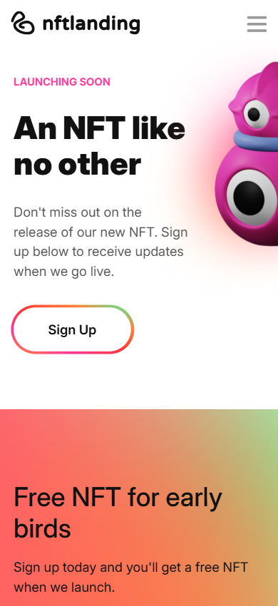
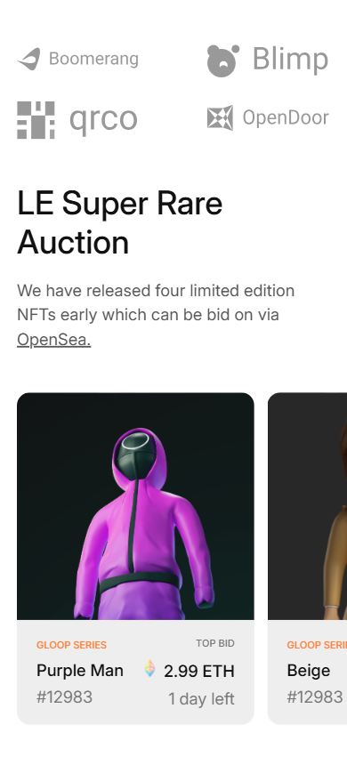
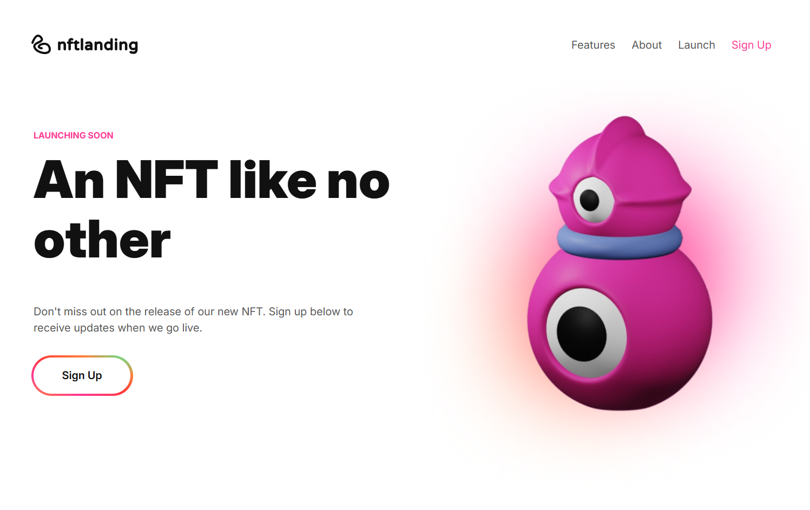
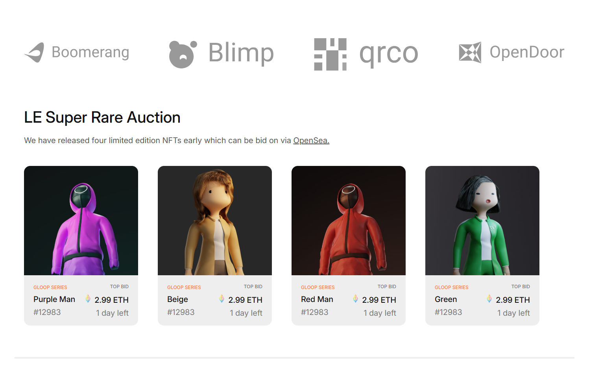

# Responsive Web Page (HTML + SCSS)

## Introduction
This project is a **mobile-first responsive webpage** built using **HTML** and **SCSS**.  
The purpose of the task was to **demonstrate SCSS structuring, usage of variables and mixins**, along with clean and semantic HTML markup after finishing html, css and scss lessons.  
The layout and styling were created based on the provided design blueprint.

---

## Getting Started

### Installation Process

1. Download or clone this repository to your computer.
2. Open the project in Visual Studio Code.
3. Make sure you have the Live Server and Sass (or Live Sass Compiler) extensions installed.
4. Start Sass compilation:
    - In VS Code: Click "Watch Sass" from the status bar to automatically compile SCSS into CSS.
5. Run the project locally - click "Go Live" in VS Code.

---

 

